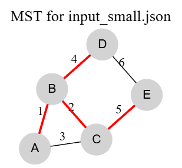
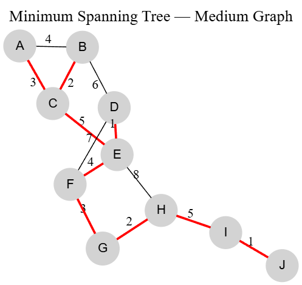
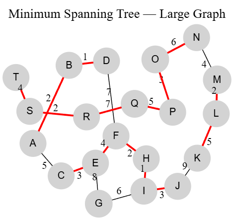
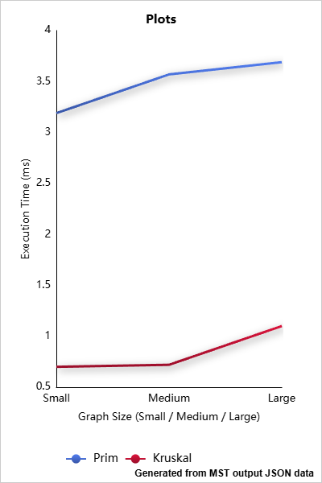

# Minimum Spanning Tree — Prim & Kruskal Algorithms

---

This project implements and compares **Prim’s** and **Kruskal’s** algorithms for finding the **Minimum Spanning Tree (MST)** of weighted, undirected graphs.

Input graphs are loaded from JSON files:
`input_small.json`, `input_medium.json`, `input_large.json`
and results are saved to corresponding output files (`output_small.json`, etc.).

##  Experimental Results

| Dataset | Vertices | Edges | Prim Cost | Kruskal Cost | Prim Ops | Kruskal Ops | Prim Time (ms) | Kruskal Time (ms) |
| ------- | -------- | ----- | --------- | ------------ | -------- | ----------- | -------------- | ----------------- |
| Small   | 5        | 6     | 12.0      | 12.0         | 5        | 5           | 3.19           | 0.70              |
| Medium  | 10       | 13    | 26.0      | 26.0         | 10       | 10          | 3.57           | 0.72              |
| Large   | 20       | 30    | 69.0      | 69.0         | 19       | 19          | 3.69           | 1.00              |

---

## Graph Visualizations

| Dataset          | MST Visualization |
| ---------------- | ----------------- |
| **Small Graph**  |                   |
| **Medium Graph** |                   |
| **Large Graph**  |                   |

>

---

## Performance Comparison

**Figure:** Execution time comparison between Prim’s and Kruskal’s algorithms.
Kruskal consistently performs faster across all datasets due to efficient edge-sorting and union-find structures.

---

## ⚙️ Algorithm Comparison



| Aspect             | Prim                                   | Kruskal                              |
| ------------------ | -------------------------------------- | ------------------------------------ |
| **Strategy**       | Builds MST by expanding nearest vertex | Builds MST by merging smallest edges |
| **Data Structure** | Min-Heap (Priority Queue)              | Disjoint Set / Union-Find            |
| **Complexity**     | O(E log V)                             | O(E log E)                           |
| **Best for**       | Dense graphs                           | Sparse graphs                        |
| **Implementation** | More intuitive, incremental            | Easier with edge list                |

---

## Conclusions

Both algorithms produced **identical MST costs**, confirming correctness.
**Kruskal’s** algorithm executed faster, especially on sparse graphs.
**Prim’s** algorithm performs well on dense graphs.
Results align with theoretical time complexities.

---

## References

1. R. Sedgewick & K. Wayne — *Algorithms (4th Edition)*, Chapter 4.3 “Minimum Spanning Trees”
2. Graph visualizations generated using **Graphviz**
3. Execution time plots created with **ChartGo**

---

### 📡 Repository Structure

```
Assignment3-MST/
│
├── src/
│   └── main/java/mst/
│       ├── Graph.java
│       ├── Edge.java
│       ├── PrimMST.java
│       ├── KruskalMST.java
│       └── Main.java
│
├── src/test/java/mst/
│       ├── TestCostEquality.java
│       ├── TestAcyclicMST.java
│       └── TestPerformanceMetrics.java
│
├── resources/
│   ├── input_small.json
│   ├── input_medium.json
│   ├── input_large.json
│   ├── output_small.json
│   ├── output_medium.json
│   └── output_large.json
│
└── docs/
    ├── small_graph.png
    ├── medium_graph.png
    ├── large_graph.png
    └── plots.png
```
